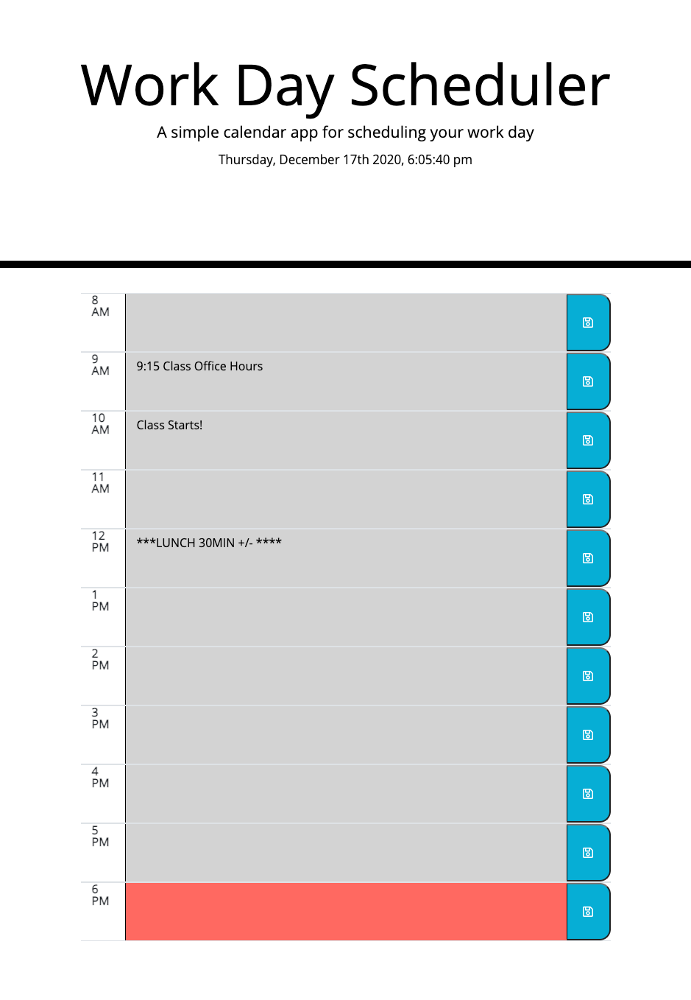
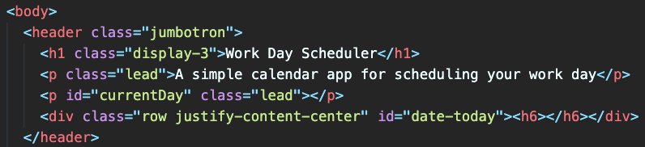
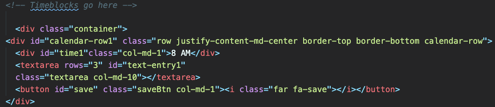
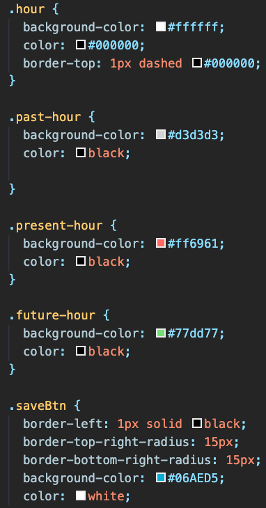
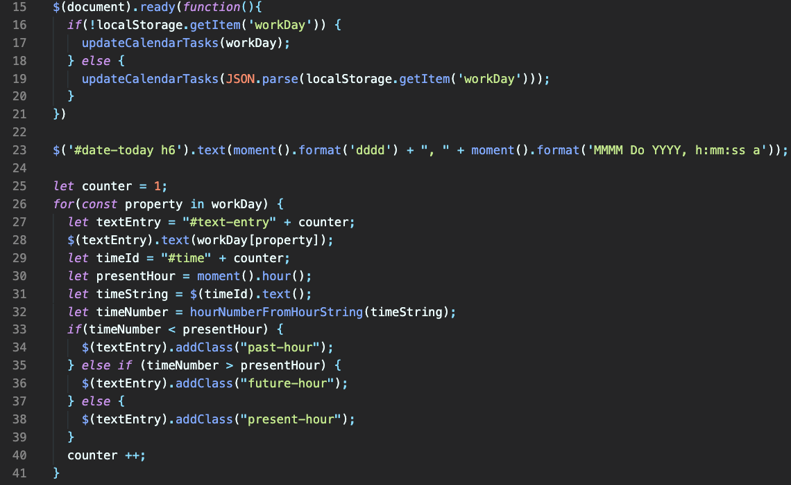

## WEEK DAY SCHEDULER:Third-Party APIs-05

**This is a simple calendar application that allows a user to save events for each hour of the day by modifying starter code. This app will run in the browser and feature dynamically updated HTML and CSS powered by jQuery using the [Moment.js](https://momentjs.com/) library to work with dates and times. **


## CRITERIA
```
GIVEN I am using a daily planner to create a schedule
WHEN I open the planner
THEN the current day is displayed at the top of the calendar
WHEN I scroll down
THEN I am presented with time blocks for standard business hours
WHEN I view the time blocks for that day
THEN each time block is color-coded to indicate whether it is in the past, present, or future
WHEN I click into a time block
THEN I can enter an event
WHEN I click the save button for that time block
THEN the text for that event is saved in local storage
WHEN I refresh the page
THEN the saved events persist
```

## SCREENSHOTS

The following animation demonstrates the application functionality:



#### CODE SNIPPETS

**HTML | code snippet**




**CSS | code snippet**



**JavaScript | code snippet**



## GitHub Repository & Deployed Site


[Click here to view published site] or (https://danielthomas129.github.io/Week-Day-Schedule/)

[Click here to view Github Repository] or (https://github.com/danielthomas129/Week-Day-Schedule)
- - -

### Daniel Thomas Guadalupe

© 2020 Trilogy Education Services, a 2U, Inc. brand. All Rights Reserved.
